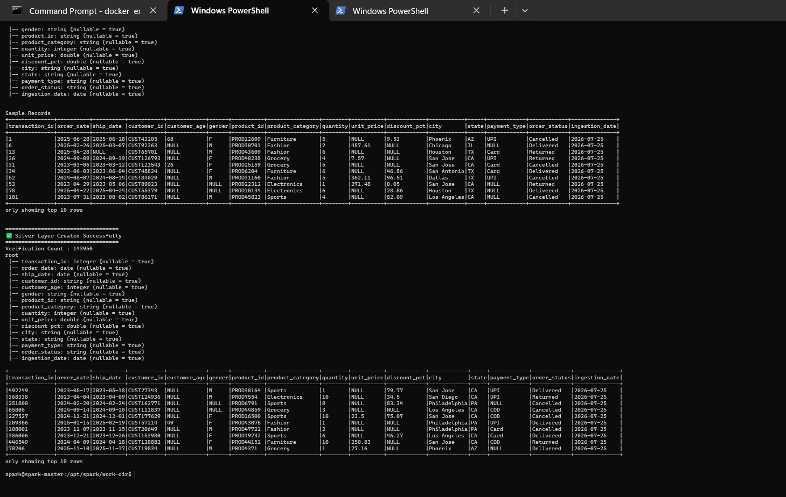
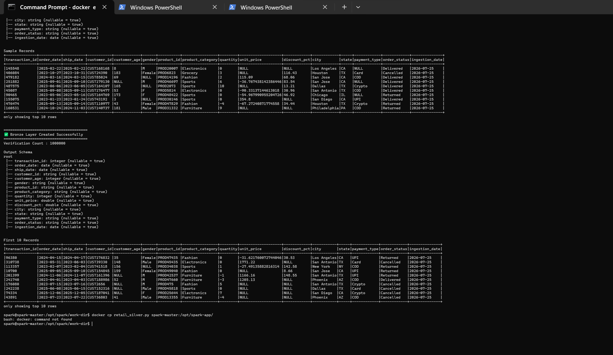
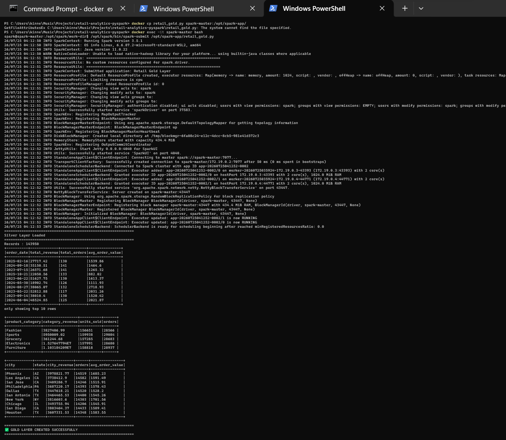

# 🛒 Retail Analytics Pipeline using PySpark


An end-to-end **Data Engineering Project** demonstrating the implementation of the **Medallion Architecture (Bronze → Silver → Gold)** using **Apache Spark, PySpark, Docker, and Parquet**.

The project processes **1 Million Retail Sales Records**, performs data cleaning and validation, and generates business-ready analytical datasets for reporting and decision-making.

---

# 📌 Project Overview

Modern Data Engineering pipelines organize data into multiple layers to improve data quality, reliability, and performance.

This project follows the **Medallion Architecture**:

- **Raw Layer** – Generated retail transaction data (CSV)
- **Bronze Layer** – Raw data stored as Parquet
- **Silver Layer** – Cleaned and validated data
- **Gold Layer** – Business-ready aggregated datasets

---

# 🏗️ Architecture

```text
                    +-------------------------+
                    |  Raw Retail CSV Data    |
                    +-----------+-------------+
                                |
                                |
                                ▼
                    +-------------------------+
                    |     Bronze Layer        |
                    | Raw Data (Parquet)      |
                    +-----------+-------------+
                                |
                                |
                                ▼
                    +-------------------------+
                    |     Silver Layer        |
                    | Cleaned & Validated     |
                    +-----------+-------------+
                                |
                                |
                                ▼
                    +-------------------------+
                    |      Gold Layer         |
                    | Business Aggregations   |
                    +-------------------------+
```

---

# 🛠️ Tech Stack

- Python 3
- Apache Spark 3.5
- PySpark
- Docker
- Docker Compose
- Parquet
- Git
- GitHub

---

# 📂 Project Structure

```text
retail-analytics-pyspark/
│
├── app/
│   ├── generate_raw_data.py
│   ├── retail_bronze.py
│   ├── retail_silver.py
│   └── retail_gold.py
│
├── data/
│   ├── raw/
│   ├── bronze/
│   ├── silver/
│   └── gold/
│
├── images/
│   ├── bronze_output.png
│   ├── silver_output.png
│   └── gold_output.png
│
├── docker-compose.yml
├── requirements.txt
├── README.md
└── .gitignore
```

---

# 📊 Dataset

The project uses a **synthetic retail sales dataset** containing approximately:

- ✅ 1,000,000 Records

Dataset columns include:

- Transaction ID
- Order Date
- Ship Date
- Customer ID
- Customer Age
- Gender
- Product ID
- Product Category
- Quantity
- Unit Price
- Discount Percentage
- City
- State
- Payment Method
- Order Status

---

# 🚀 Pipeline Workflow

## Step 1 – Generate Raw Dataset

Generate the retail sales dataset.

```bash
python app/generate_raw_data.py
```

Output

```text
data/raw/retail_sales_raw.csv
```

---

## Step 2 – Start Spark Cluster

```bash
docker-compose up -d
```

Verify running containers

```bash
docker ps
```

---

## Step 3 – Bronze Layer

Run

```bash
docker exec -it spark-master bash

/opt/spark/bin/spark-submit /opt/spark-app/retail_bronze.py
```

### Bronze Layer Tasks

- Read Raw CSV
- Apply Schema
- Convert CSV to Parquet
- Store Raw Parquet Data

Output

```text
data/bronze/
```

---

## Step 4 – Silver Layer

Run

```bash
/opt/spark/bin/spark-submit /opt/spark-app/retail_silver.py
```

### Silver Layer Tasks

- Remove duplicate records
- Remove invalid quantities
- Remove invalid prices
- Remove invalid discounts
- Validate ship dates
- Normalize gender values
- Normalize payment methods
- Produce cleaned dataset

Output

```text
data/silver/
```

---

## Step 5 – Gold Layer

Run

```bash
/opt/spark/bin/spark-submit /opt/spark-app/retail_gold.py
```

Generated datasets

- Daily Sales Metrics
- Product Category Performance
- City Revenue Metrics

Output

```text
data/gold/
```

---

# 📷 Pipeline Execution Screenshots

## Bronze Layer

Raw CSV data successfully ingested into the Bronze layer.



---

## Silver Layer

Data cleaned, validated, and transformed.



---

## Gold Layer

Business-ready aggregated datasets generated successfully.



---

# 📈 Gold Layer Business Metrics

The Gold layer generates analytics-ready datasets.

### Daily Sales Metrics

- Daily Revenue
- Total Orders
- Average Order Value

---

### Product Category Performance

- Revenue by Category
- Units Sold
- Total Orders

Example

| Product Category | Revenue |
|-----------------|---------:|
| Electronics | Highest |
| Furniture | Second |
| Sports | Third |

---

### City Revenue Metrics

- Revenue by City
- Number of Orders
- Average Order Value

Example

| City | Revenue |
|------|---------:|
| Phoenix | Highest |
| New York | Top Performing |
| Los Angeles | High Revenue |

---

# 🧹 Data Cleaning Performed

The Silver layer performs several validation and cleaning operations.

✔ Removed duplicate records

✔ Removed invalid quantities

✔ Removed invalid prices

✔ Removed invalid discounts

✔ Fixed invalid ship dates

✔ Standardized gender values

✔ Standardized payment methods

✔ Stored cleaned data as Parquet

---

# ⚡ Spark Concepts Demonstrated

- Spark DataFrames
- Explicit Schema
- Spark Transformations
- Spark Actions
- Data Cleaning
- Filtering
- GroupBy
- Aggregations
- Parquet Storage
- Distributed Processing
- Docker-based Spark Cluster
- Medallion Architecture

---

# 🎯 Skills Demonstrated

- Apache Spark
- PySpark
- ETL Pipeline Development
- Docker
- Docker Compose
- Data Validation
- Data Cleaning
- Business Aggregations
- Distributed Data Processing
- Git
- GitHub
- Data Engineering Best Practices

---

# 💼 Use Cases

This project demonstrates how retail companies can:

- Analyze product performance
- Track city-wise revenue
- Monitor daily sales
- Generate business reports
- Build scalable ETL pipelines

---

# 🚀 Future Enhancements

- Delta Lake
- Incremental Data Loading
- Change Data Capture (CDC)
- Slowly Changing Dimensions (SCD Type 2)
- Apache Airflow
- Azure Data Factory
- Azure Databricks
- Azure Synapse Analytics
- Power BI Dashboard

---

# ▶️ How to Run

Clone the repository

```bash
git clone https://github.com/<your-github-username>/retail-analytics-pyspark.git

cd retail-analytics-pyspark
```

Start Spark

```bash
docker-compose up -d
```

Generate raw data

```bash
python app/generate_raw_data.py
```

Run Bronze Layer

```bash
docker exec -it spark-master bash

/opt/spark/bin/spark-submit /opt/spark-app/retail_bronze.py
```

Run Silver Layer

```bash
/opt/spark/bin/spark-submit /opt/spark-app/retail_silver.py
```

Run Gold Layer

```bash
/opt/spark/bin/spark-submit /opt/spark-app/retail_gold.py
```

---

# 📌 Learning Outcomes

By completing this project, you will gain hands-on experience with:

- Building scalable ETL pipelines
- Apache Spark and PySpark
- Data Cleaning & Validation
- Dockerized Spark Clusters
- Medallion Architecture
- Parquet File Format
- Business Analytics
- Git Version Control

---

# 👨‍💻 Author

**Your Name**

- GitHub: https://github.com/your-github-username
- LinkedIn: https://linkedin.com/in/your-linkedin-profile

---

# ⭐ Support

If you found this project helpful, consider giving it a ⭐ on GitHub.

It helps others discover the project and motivates future improvements.